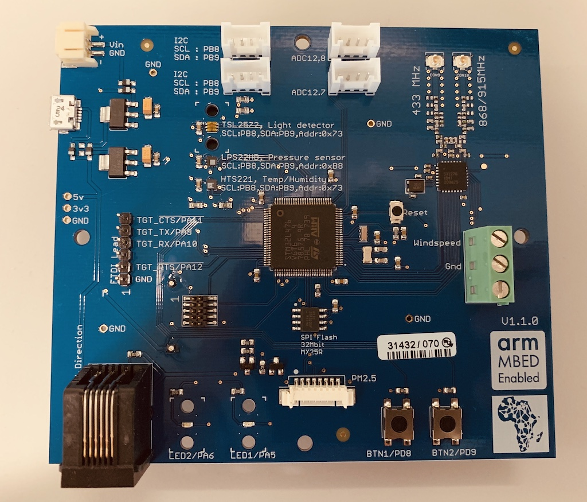
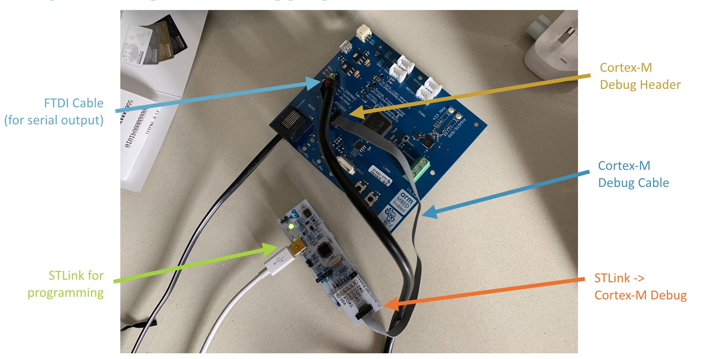

# Data Science Africa 2019 firmware

This is the firmware for the [DSA 2019](https://www.datascienceafrica.org/dsa2019addis/) environmental sensor.



The board contains:

* STM32L475VG MCU.
* SX1276 LoRa radio.
* TSL2572 light sensor.
* LPS22HB barometric pressure sensor.
* HTS221 temperature / humidity sensor.
* Connector for PMS5003 particle monitor.
* Connector for Davis anemometer.
* 2 buttons.
* 2 LEDs.
* 4 Grove connectors, one is used for soil moisture.
* Battery holder at the back (4x AA).

This was designed for Data Science Africa 2019 by Chris Styles (Arm). It's not for sale, but the design files are open source and available under the [Mbed HDK](https://github.com/ARMmbed/mbed-HDK-Eagle-Projects).

## Programming the board

To program the board you'll need an STLink or a NUCLEO board, a Cortex-M debug cable, and an FTDI cable. Connect it like this:



After you connect the STLink to your computer it mounts as a flash storage device (e.g. called 'NODE_F446RE'). If there is a file `fail.txt` present you've made a mistake connecting the board.

## Setting LoRaWAN credentials

The device connects to a LoRaWAN network, for which you'll need an Application EUI and an Application Key (e.g. from The Things Network). The Device EUI is generated from the unique serial number in the MCU, and will be printed when running the program.

Open `main.cpp` and set the credentials under `APP_EUI` and `APP_KEY`.

After you start the application you'll something like:

```
Data Science Africa 2019
DevEUI:        0047500a20523711
AppEUI:        70b3d57ed000eebb
AppKey:        7c8517db192bd214e116b978464dc1ba
```

Register the device with these credentials with your LoRaWAN network provider.

## Setting the operation mode

The device supports three modes: environmental, wind, and PM 2.5. Depending on the mode you'll need to connect different hardware:

* Environmental: connect Grove soil moisture sensor to ADC12_7.
* Wind: connect Davis anemometer.
* PM2.5: connect PMS5003 particle monitor.

The mode can be set through the defines in `main.cpp` under `DSA_MODE`.

In addition you can set the operating interval. This has a direct effect on the battery life of the device. E.g. the particle monitor draws 200 mA, and requires 3 minutes of sampling. This'll give you about 250 samples before the battery runs out. When you set `PAUSE_BEFORE_SENDING` higher the device will be in deep sleep, and will thus last much longer.

Deep sleep current is about 80 uA.

## Building this application

You'll need [Mbed CLI](https://github.com/ARMmbed/mbed-cli) and its requirements (hg/git/arm-none-eabi-gcc). Then:

1. Clone this repository and its dependencies:

    ```
    $ mbed import https://github.com/janjongboom/dsa-firmware-2019
    ```

1. Build this application:

    ```
    $ mbed compile -m DISCO_L475VG_IOT01A -t GCC_ARM
    ```

1. Copy the application (mount point depends on your debugger):

    ```
    $ cp BUILD/DISCO_L475VG_IOT01A/GCC_ARM/dsa-firmware-2019.bin /Volumes/NODE_F446RE
    ```

1. Afterwards, connect a serial monitor to the FTDI device with baud rate 115,200.

## Data format

The device spits out data in CayenneLPP format. This is supported natively by The Things Network. In your application go to **Payload Formats** and select **CayenneLPP** to automatically decode messages.

However, when in PM2.5 mode the particle data is added to the end of the message, and you'll need a custom decoder. A decoder is included in this repository under [parse-payload.js](parse-payload.js). Use it like this:

```
$ node parse-payload.js 016700C0026876036700E604731D1E0565119706030018070300190B00130014000B0013001400000962027C000E0002000000

{ pm10_standard: 11,
  pm25_standard: 19,
  pm100_standard: 20,
  pm10_env: 11,
  pm25_env: 19,
  pm100_env: 20,
  particles_03um: 2304,
  particles_05um: 610,
  particles_10um: 124,
  particles_25um: 14,
  particles_50um: 2,
  particles_100um: 0,
  'Temperature Sensor (1)': 19.2,
  'Humidity Sensor (2)': 11.8,
  'Temperature Sensor (3)': 23,
  'Barometer (4)': 745.4,
  'Illuminance Sensor (5)': 4503,
  'Analog Output (6)': 0.24,
  'Analog Output (7)': 0.25 }
```

The CayenneLPP channels are:

1. Temperature value from HTS221.
2. Humidity value from HTS221.
3. Temperature value from LPS22HB.
4. Barometer value from LPS22HB.
5. Light value (lux) from TSL2572.
6. Analog value of the ADC12_7 connector (soil moisture).
7. Analog value of the ADC12_8 connector.
8. Wind direction of the Davis anemometer (divided by 10!) in degrees.
9. Wind speed of the Davis anemometer (km/h).

Not all channels will be present depending on the operating mode.
